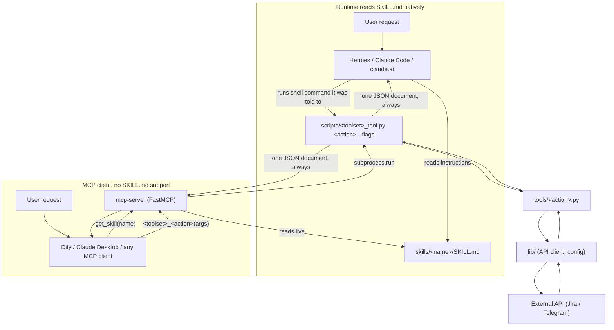

# Architecture

This document explains *why* this repo is shaped the way it is, how a
request actually flows through it, and what the core entities are --
for a human or an AI reading the code cold, not just a human who
already knows the codebase. It complements, not replaces:

- [`README.md`](README.md) -- installation, the Agent Skills format,
  and the full skill catalog.
- [`AGENTS.md`](AGENTS.md) -- the concrete rules a contributor (human or
  agent) must follow when adding or changing a skill.
- [`mcp-server/README.md`](mcp-server/README.md) -- operational detail
  for the MCP server specifically.

## Purpose

This repo is a **portable, versioned instruction layer for AI agents**:
a collection of `SKILL.md`-fronted directories that tell an agent, in
plain markdown, how to accomplish a real task against a real system
(Jira, a personal Telegram account, a PRD/TRD-writing convention) --
plus, where the task needs real API calls, the actual code to do it
safely.

The problem it solves: an agent's *capability* to call a REST API or
run a shell command is not the same as its *knowledge* of how a
specific team wants that capability used -- which project key to
default to, when a write needs human confirmation, what "done" means
for a worklog day. This repo is where that knowledge lives, written
once, and read by whichever runtime the agent happens to be (Hermes,
Claude Code, claude.ai natively; anything else via the [MCP
server](mcp-server)) -- see "Two ways to reach the same skill" below.

## Core concepts

| Term | Meaning |
|---|---|
| **Skill** | One `SKILL.md`-fronted directory under `skills/`. The unit an agent runtime installs and matches a user request against. |
| **Toolset** | A skill backed by real code: `lib/` (API client, env-based config), `tools/` (one Python module per action), `scripts/<name>_tool.py` (a CLI dispatcher exposing every tool as a subcommand), `tests/`. `jira` and `telegram` are the two toolsets today. |
| **Thin wrapper skill** | A `SKILL.md`-only directory (e.g. `jira-worklog/`) with no code of its own, that documents one toolset action for runtimes (like Hermes) that map one skill to one slash command. It shells out to its toolset's own CLI dispatcher; it has nothing to test. |
| **Standalone skill** | A `SKILL.md`-only directory with **no backing toolset at all** -- `mood`, `prd`, `trd`. Pure instructions: there's no code path, no CLI, nothing to execute. The agent's own general-purpose tools (file writes, its own reasoning) carry out the instructions directly. This distinction matters a lot for workflow automation -- see below. |
| **Internal skill** | `metadata.internal: true` in a `SKILL.md`'s frontmatter. Excluded from default installs and from the MCP server's tool list unless explicitly opted into (`INSTALL_INTERNAL_SKILLS=1` / `--include-internal`). `telegram` is the only one today, because it grants standing access to a real personal account. |
| **Confirm gate** | The code-level check every write action makes before doing anything irreversible: `{"confirmed": false, "requires_confirmation": true, "pending_action": {...}}` on the first call, real execution only once `--confirm`/`confirm=True` is passed (or `*_AUTO_CONFIRM_WRITES=true` is set). This lives in the tool code itself, not just in `SKILL.md` prose -- see "Security model" below. |
| **MCP server** | [`mcp-server/`](mcp-server) -- a small FastMCP server, added later, that exposes the same skills to MCP clients that can't read `SKILL.md` natively. Not a skill or a toolset itself. |

## Two ways to reach the same skill



Both paths terminate in the exact same `scripts/<toolset>_tool.py`
subprocess call and the exact same JSON response shape. The MCP server
does not reimplement any tool's behavior -- it's a thin adapter that
(a) reads `SKILL.md` files live to serve instructions, and (b)
introspects each toolset's `argparse` definition to generate typed MCP
tools that shell out to the same CLI every native runtime already uses.
Nothing about validation, error shapes, or confirm-gating is duplicated
or reimplemented on the MCP side; see
[`mcp-server/lib/introspect.py`](mcp-server/lib/introspect.py) and
[`mcp-server/lib/execute.py`](mcp-server/lib/execute.py).

**Standalone skills only have the left-hand path's second half missing
a code box** -- there is no `scripts/..._tool.py` to call. A standalone
skill's `SKILL.md` body *is* the entire deliverable: an agent reads it
and carries out the instructions with its own general-purpose
abilities (writing a file, reasoning about a document's structure).
This is why the MCP server exposes standalone skills only through
`get_skill` (raw instructions text) and generates no execution tool for
them at all -- there is nothing to generate a tool *from*.

## Security model

Every write action (`worklog`, `create_issue`, `transition`,
`send_message`, ...) is gated **in code**, not just in `SKILL.md`
prose, because an agent that ignores its own instructions is exactly
the failure mode the gate exists to catch:

- **Two-step confirm (the baseline).** A write tool's first call
  returns `{"confirmed": false, "requires_confirmation": true,
  "pending_action": {...}}` instead of doing anything. Only a second
  call with `confirm=True` (or `*_AUTO_CONFIRM_WRITES=true` set in the
  environment) executes. This is the pattern every `jira` write uses.
- **Stricter-than-baseline where the consequence warrants it.**
  `telegram`'s outbound actions (`send_message`, `send_bulk`,
  `forward_message`) go further: in the default `TELEGRAM_CONFIRM_MODE=tty`,
  they require a literal `yes` typed at a real controlling terminal
  (`/dev/tty`) -- something no calling agent, MCP client, or automated
  workflow can supply on its own. See
  [`skills/telegram/lib/guard.py`](skills/telegram/lib/guard.py). This
  is *why* telegram doesn't fit cleanly into headless automation -- see
  "Automating a workflow" below.

The MCP server does not add, remove, or weaken any of this -- a gated
tool called over MCP behaves identically to the same tool called over a
shell, because it's the same code, run the same way.

## Entities reference

Kept intentionally brief -- these are pointers to where the real
definitions live, not a duplicate of them.

**Repo-wide / MCP server** (`mcp-server/lib/`):
- `SkillManifest` (`registry.py`) -- one discovered skill: name, kind
  (`standalone`/`toolset_root`/`toolset_thin_wrapper`), frontmatter,
  body, and (for a toolset root) its CLI script path.
- `SubcommandSpec` / `ParamSpec` (`introspect.py`) -- one CLI
  subcommand's name/help/parameters, extracted from a toolset's own
  `argparse.build_parser()`.
- `GeneratedTool` (`mcp_tools.py`) -- a `fastmcp` `Tool` built from a
  `SubcommandSpec`, whose `run()` shells out via `execute_subcommand`.

**Jira toolset** (`skills/jira/lib/models.py`, `jira_client.py`):
- `Issue`, `Worklog`, `Comment`, `Sprint`, `Board`, `User`, `IssueLink`
  -- typed dataclasses, each with a `.to_dict()` used to build every
  tool's JSON response.
- `JiraClient` -- the single HTTP client, obtained via the
  process-wide `get_client()` singleton; owns auth, retries, and every
  typed API call.
- `JiraConfig` -- env-sourced config (`JIRA_BASE_URL`, credentials,
  `auto_confirm_writes`, `default_project`, ...), loaded once via
  `load_config()`.

**Telegram toolset** (`skills/telegram/lib/`):
- `TelegramConfig`, `SessionState` (`auth.py`) -- env-sourced config and
  the on-disk session's TTL/expiry state.
- `Peer` (`models.py`) -- a chat/user resolved once at login and
  addressed thereafter without any enumeration call.
- `gate()` (`guard.py`) -- the confirm-mode dispatcher described above.

## Repository layout

See [`AGENTS.md`](AGENTS.md#repo-layout) for the authoritative,
rule-by-rule layout description (what goes in `lib/` vs `tools/` vs
`scripts/`, when a thin wrapper skill is warranted, etc.). In brief:

```
skills/
├── jira/            toolset: lib/ tools/ scripts/ tests/ requirements.txt README.md
├── jira-*/          17 thin wrapper skills, one per jira action
├── telegram/         toolset, metadata.internal: true
├── mood/ prd/ trd/    standalone skills -- SKILL.md only, no code
mcp-server/            MCP adapter -- not a skill or toolset, see below
```

## Automating a workflow on top of this repo (e.g. Dify)

A common shape: **product input -> doc generation -> human
approve/revise -> push to Jira/Confluence/Notion -> notify a
developer.** Here's how that maps onto what exists today, and what
doesn't yet.

1. **Doc generation from a brief (`prd` / `trd`, and any future `erd`/
   `adr`/`rfc`) is a standalone skill -- there is no tool that
   generates the document itself.** Wire it as an LLM/agent node whose
   system prompt is the output of `doc_gen(doc_type="prd")` (or
   `"trd"`) -- the real, current instructions, fetched live, not
   copy-pasted into your workflow tool and left to rot. `doc_gen`'s
   `doc_type` is a real enum in its MCP schema, built from whichever
   standalone skills declare `metadata.doc_type: <slug>` in their own
   `SKILL.md` -- adding a new document template later (e.g.
   `skills/erd/SKILL.md` with `metadata.doc_type: erd`) makes it show
   up in `doc_gen` automatically, no server changes needed. The node's
   own output is the generated document; your workflow decides where
   that document lands (a file, a database row, directly into the next
   step).
2. **Approve/revise is your workflow tool's job, not this repo's.**
   Nothing here models a human-in-the-loop review step -- that's Dify
   (or whichever workflow tool) pausing for input, not a skill.
3. **Pushing to Jira works today** -- once your MCP client is pointed
   at [`mcp-server/`](mcp-server) (see its README), a workflow's "call
   a tool" step can call `jira_create_issue`, `jira_worklog`, etc.
   directly, with the same confirm-gating behavior described above (a
   workflow step can supply `confirm: true` once *it* has gotten
   sign-off from the approve/revise step -- that's your workflow
   enforcing the human step, this repo enforcing the write itself is
   real).
4. **Confluence and Notion toolsets don't exist in this repo yet.**
   That's a real gap, not a hidden feature -- to add either, follow
   "Adding a toolset" in `README.md` (own `lib/`/`tools/`/`scripts/`/
   `tests/`, credentials from env vars only, writes gated in code the
   same way Jira's are). Once added, **the MCP server picks it up with
   zero code changes** -- its tools are generated from the new
   toolset's own `build_parser()` at startup, the same way jira's are
   today.
5. **"Deliver to developer"** is most naturally a `jira_edit_issue`
   assignee change or a comment, once that action exists as a tool
   call in your workflow. `telegram` could theoretically notify a
   person directly, but its outbound actions are deliberately built to
   resist exactly this kind of headless automation (see "Security
   model" above) -- treat that as a signal it's the wrong tool for an
   automated notification step, not an obstacle to route around.
