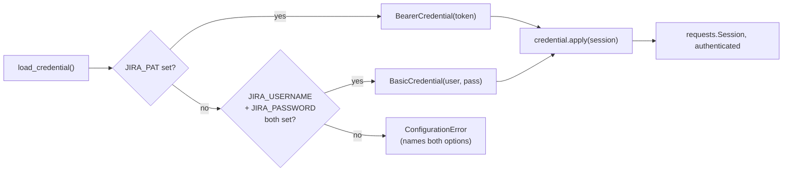
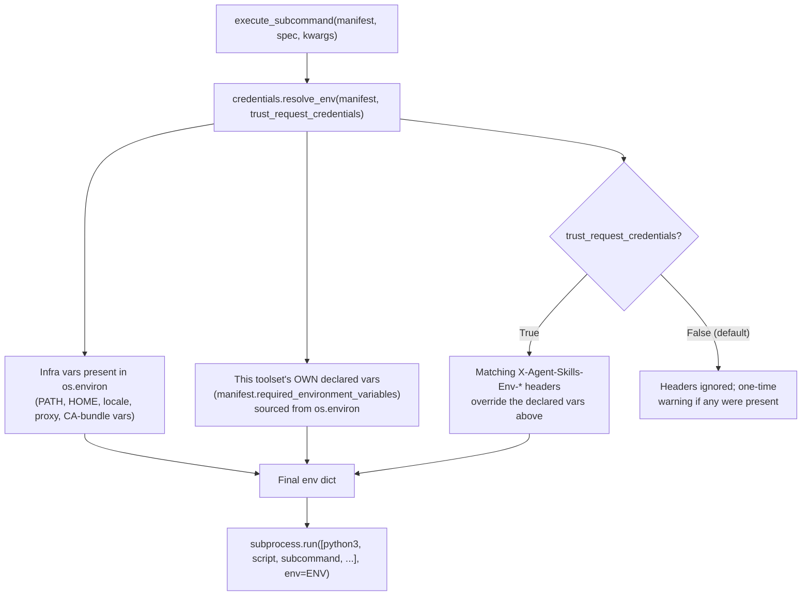
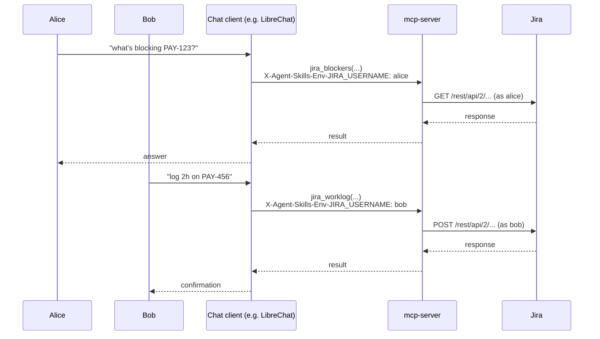

# Authentication and credentials

This document explains how credentials and authentication work across
this whole repo -- for a toolset used directly (a skill on your own
laptop) and for the same toolset served over MCP to a multi-user chat
client. It's written for whoever maintains or extends this later,
including a future you. It complements, not replaces:

- [`ARCHITECTURE.md`](ARCHITECTURE.md) -- the repo's overall shape and
  its confirm-gate security model (a *different* concern from this
  document: confirm-gating is about "should this write happen at all,"
  this document is about "who is this write happening as").
- [`AGENTS.md`](AGENTS.md) -- the concrete rules a contributor follows;
  its "Conventions" section states the credential/`sensitive: true`
  rules this document explains the reasoning behind.
- [`mcp-server/README.md`](mcp-server/README.md) -- operational
  reference for the server's flags and env vars specifically.
- [`skills/jira/README.md`](skills/jira/README.md) -- Jira's own
  concrete config table, as the first (and currently only) toolset
  using everything described here.

If you only read one thing, read "The one sentence version" and "Part 4:
security properties" -- everything else is detail in service of those.

---

## The one sentence version

**A toolset logs in with whatever credential it's handed, and never
knows or cares where that credential came from** -- your own shell's
environment variables when you run it yourself, or a specific caller's
credential that `mcp-server` resolved just for that one request when
it's serving many different people through one running server.

---

## Why this exists (plain English)

Every toolset in this repo -- Jira today, more later -- needs to log
into some real system. The obvious way is environment variables:
`JIRA_USERNAME`, `JIRA_PASSWORD`. That's simple, it's genuinely correct
for one person running one script on their own machine, and it's the
approach this repo started with.

It breaks down the moment the *same running server* serves *many
different people*. Picture `mcp-server` sitting behind a chat app like
LibreChat, with Alice and Bob both typing requests into the same chat
interface. If the server's Jira credential is one fixed environment
variable, then every action -- Alice's and Bob's alike -- hits Jira as
the exact same account. Jira's own audit log can't tell them apart.
Jira's own permissions can't be different for them. And the very first
requirement this whole effort was built around -- "let product-team
users touch Jira, but not GitLab" -- literally cannot be enforced,
because the server has no concept of *who* is asking.

So there are two genuinely different problems hiding in "authentication"
here, and this document is organized around keeping them separate,
because conflating them is the easiest way to design this wrong:

1. **Which credential does a toolset use to talk to Jira (or Confluence,
   or GitLab, later)?** This is "outbound" -- the toolset calling out to
   some third-party system. **Part 1 and Part 2** below.
2. **Who is allowed to talk to `mcp-server` in the first place, and how
   does it know?** This is "inbound" -- a caller reaching this server.
   **Part 3** below.

Knowing *who* is calling (problem 2) is what makes it safe to let that
caller's own credential override the server's default (problem 1). They
solve different problems, but the second is what makes the first
trustworthy rather than just self-asserted.

**What this deliberately is not: a credential store.** `mcp-server`
never saves, encrypts, enrolls, or remembers anyone's credential. It
accepts one for the duration of one call and uses it, nothing more.
Storage -- if a deployment wants one-time-per-user enrollment instead of
re-sending a credential on every call -- is the calling client's job
(e.g. LibreChat's own per-user encrypted variable storage), not this
repo's.

---

## Part 1: a toolset's own credential (personal, direct use)

This is unchanged in spirit from how this repo always worked, and it's
still the *only* thing that matters if you're running a toolset
yourself, by hand, or through a runtime that reads `SKILL.md` natively
(Claude Code, Hermes, claude.ai). None of the multi-user machinery in
Parts 2-3 is involved at all in this path.

### The shape: a `Credential`, not a hardcoded auth scheme

`skills/jira/lib/auth.py` used to hardcode HTTP Basic auth directly:
`session.auth = (username, password)`. That's now split into two
independent pieces:

- **`JiraConfig`** -- purely behavioral settings: `base_url`,
  `timeout_seconds`, `max_retries`, `verify_ssl`,
  `auto_confirm_writes`, `default_project`, `deployment_type`. No
  credential material at all.
- **A `Credential`** -- purely the auth material, returned by
  `load_credential()`. `JiraClient` never touches `username`/`password`
  itself; it calls `credential.apply(session)` and the credential
  decides what that means.

```python
# skills/_shared/credentials/http.py
class Credential(Protocol):
    def apply(self, session: requests.Session) -> None: ...

class BasicCredential:   # HTTP Basic -- username + password
class BearerCredential:  # Authorization: Bearer <token>
class NoCredential:      # explicit "no auth needed", not an oversight
```

`BearerCredential` deliberately covers three different real-world
things with one type, because the wire format is identical for all of
them: a Jira Data Center **Personal Access Token**, a plain **API key**,
or an **OAuth access token**. One code path, whichever of the three a
deployment actually has.

### Jira's concrete precedence

`skills/jira/lib/auth.py`'s `load_credential()`:

1. **`JIRA_PAT` set** -> `BearerCredential`. Wins if both are set,
   since minting a PAT is a deliberate choice that should take
   precedence over a Basic pair that might just be left over.
2. **`JIRA_USERNAME` + `JIRA_PASSWORD` both set** -> `BasicCredential`.
3. **Neither fully configured** -> `ConfigurationError`, naming both
   options in the message so you're not left guessing which var to set.



### Why the shared module is a symlink, not a copy

`skills/_shared/credentials/http.py` holds the `Credential` types.
`skills/jira/lib/credentials.py` is a **symlink** to it
(`ln -s ../../_shared/credentials/http.py skills/jira/lib/credentials.py`),
not a copy -- so a future Confluence or GitLab toolset (both of which
authenticate a `requests.Session` the same way -- confirmed directly
from GitLab's own docs that its API accepts `Authorization: Bearer
<token>`, not just its `PRIVATE-TOKEN` header) can symlink the exact
same file, and one fix updates every consumer at once.

This survives both ways this repo is consumed, verified against the
real installer source, not assumed:

- **A direct `git clone`** preserves the symlink natively -- nothing
  special to do.
- **`npx skills add --skill jira`** ([`vercel-labs/skills`](https://github.com/vercel-labs/skills))
  does a real `git clone` of the whole repo into a temp directory (for
  any repo not on its own fast-path allowlist, which this one isn't),
  then extracts just the requested skill's directory with
  `fs.cp(src, dest, { dereference: true })` -- Node's own "follow the
  symlink and copy the real file" mode. The installer's own source
  comment explains why: *"If the file is a symlink to elsewhere in a
  remote skill, it may not resolve correctly once it has been copied to
  the local location."* This is exactly `skills/jira/lib/credentials.py`'s
  situation, handled on purpose by the tool's own authors.

**`skills/_shared/` can never itself be installed or discovered as a
skill.** Both consumers above find skills by walking for `SKILL.md`'s
presence -- `mcp-server/lib/registry.py`'s `discover_skills()` filters on
`entry.is_dir() and skill_md.exists()`, and `vercel-labs/skills`'s own
`discoverSkills()` does the same. A directory with no `SKILL.md` is
structurally invisible to either, not just conventionally excluded.
`skills/_shared/README.md` states this explicitly (never add a
`SKILL.md` there), and `mcp-server/tests/test_registry.py` has two tests
guarding it: one proving the general mechanism, one checking the real
`skills/_shared/` directory in this actual repo has no `SKILL.md` today.

### Adding this pattern to a new toolset

1. If the new toolset authenticates an HTTP session the same way (Basic
   or a bearer token), symlink the existing shared file:
   `ln -s ../../_shared/credentials/http.py skills/<toolset>/lib/credentials.py`.
   If it needs a genuinely different shape (see "What's deliberately not
   built yet" below), that's a new file under `skills/_shared/credentials/`,
   not a variant crammed into `http.py`.
2. Write that toolset's own `load_credential(env=None)` in its own
   `lib/auth.py`, reading whatever env vars make sense for that system
   (mirroring Jira's `JIRA_PAT`/`JIRA_USERNAME`/`JIRA_PASSWORD` pattern).
3. Wherever the toolset's client currently does `session.auth = (...)`
   or sets an `Authorization` header by hand, replace it with
   `credential.apply(session)`.
4. Mark the actually-secret vars `sensitive: true` in that toolset's
   `SKILL.md` frontmatter (see Part 2's redaction section for why).
5. Nothing in `mcp-server` needs to change for any of this -- Part 2
   below already works for any toolset whose `required_environment_variables`
   frontmatter is accurate, generically.

### What's deliberately not built yet

A future **`git`** toolset (operating on repos directly via the `git`
CLI, not a REST API) needs a genuinely different credential shape --
SSH keys or a credential helper, not a value you set on a
`requests.Session`. That's a different enough problem (a private key
especially should never be handled like a bearer token -- e.g. never
passed as a header value the way Part 2 does for HTTP credentials) that
it's intentionally not designed here. When that toolset actually exists,
it gets its own module under `skills/_shared/credentials/` (e.g.
`process.py`), built against a real requirement instead of guessed at
in advance.

---

## Part 2: per-request credentials (`mcp-server`, multi-user)

Everything in Part 1 is what happens when `mcp-server`'s own process
environment is the only source of truth -- which is still true by
default, and true always under `stdio`. This part is what changes when
a deployment opts in to letting different callers use different
credentials against the same running server.

### The old behavior, and the two problems with it

`mcp-server/lib/execute.py` used to build every subprocess's
environment as a flat `os.environ.copy()` -- literally, hand the
toolset's subprocess the server's *entire* environment. Two real
problems followed from this, found by actually auditing the code rather
than assumed:

1. **One process, one identity.** There's exactly one `JIRA_USERNAME`
   in the server's own environment. Every caller uses it. No way to
   swap in a different credential per request.
2. **Cross-toolset leakage.** Since the *entire* environment was
   copied, a Jira subprocess could see `TELEGRAM_*` variables too, and
   vice versa -- nothing scoped a toolset to only its own declared
   credentials.

### The fix: scoped, per-call resolution

`mcp-server/lib/credentials.py`'s `resolve_env()` builds a fresh
environment for every single subprocess call, from exactly two sources:



- **Infra vars** (`_INFRA_ENV_VARS` in `credentials.py`): `PATH`, `HOME`,
  `LANG`/`LANGUAGE`/`LC_ALL`/`LC_CTYPE`, `TMPDIR`/`TMP`/`TEMP`,
  `PYTHONPATH`/`PYTHONIOENCODING`/`PYTHONUTF8`, and proxy/CA-bundle vars
  (`HTTP_PROXY`/`HTTPS_PROXY`/`NO_PROXY` in both cases,
  `SSL_CERT_FILE`/`SSL_CERT_DIR`/`REQUESTS_CA_BUNDLE`/`CURL_CA_BUNDLE`).
  None of these are ever toolset-specific credentials, and they're
  necessary for the subprocess to function at all -- **`PATH` in
  particular is load-bearing**: confirmed empirically that
  `subprocess.run` needs `PATH` *in the env dict it's given* to resolve
  a bare command name like `"python3"` on POSIX, and this repo's own
  `mcp-server/Dockerfile` installs Python at `/usr/local/bin/python3`
  (the official `python:3.12-slim` base image's location), not somewhere
  guaranteed to be covered by any implicit fallback search path.
- **This toolset's own declared vars only** -- `manifest.required_environment_variables`
  (already parsed from that toolset's `SKILL.md` frontmatter) is the
  allowlist. A Jira call never sees `TELEGRAM_*`, full stop -- not
  filtered out after the fact, never included in the first place.

### Per-request override: the `X-Agent-Skills-Env-*` header

A caller can override one of a toolset's *own* declared vars, for one
call only, nothing persisted:

```
X-Agent-Skills-Env-JIRA_USERNAME: alice
X-Agent-Skills-Env-JIRA_PASSWORD: alices-own-password
```

Two things keep this from being a way to smuggle in arbitrary
environment variables:

- **Only vars the toolset itself declares are ever accepted.** A header
  named `X-Agent-Skills-Env-SOME_RANDOM_VAR` is silently dropped unless
  `SOME_RANDOM_VAR` is genuinely one of that toolset's own
  `required_environment_variables` entries.
- **This is deliberately generic, not LibreChat-specific.** Any HTTP
  client that can set a header can use it -- there's no assumption
  baked in about which chat platform is on the other end. (LibreChat
  happens to have a mechanism, `customUserVars`, that maps naturally
  onto sending exactly this kind of header per user, but nothing here
  depends on that specific client.)

**Concrete effect, once trusted (see below):**



Jira's own audit log now says `alice` and `bob`, not one shared service
account -- and if Alice's Jira account genuinely lacks permission for
something, Jira's own permission model enforces that correctly, because
the request really is being made as Alice.

### The trust gate: why headers are ignored by default

**A header is self-asserted.** On an unauthenticated transport, anyone
who can reach the port could set
`X-Agent-Skills-Env-JIRA_USERNAME: someone-elses-account` and be
believed. So these headers are **ignored by default** -- the resolved
environment falls back to the server's own process env, exactly Part
1's behavior, and a one-time warning is logged if a header was present
but ignored (so a misconfiguration is discoverable, not silently
ineffective).

Honoring them requires **explicitly opting in**:
`--trust-request-credentials` (or `MCP_TRUST_REQUEST_CREDENTIALS=1`).
This should only be turned on once something downstream actually
verifies who's calling -- see Part 3. Turning it on with no auth
provider configured prints a loud startup warning rather than silently
accepting a meaningless security posture (verified: this exact warning
fires in a real process start, worded to name the risk plainly).

### Redaction: a secret must never reach an LLM's context

Everything `execute_subcommand` returns goes straight into a
`ToolResult`, and therefore into whichever model is driving the chat.
Two real leak surfaces exist in the error paths:

| Surface | Where | Risk |
|---|---|---|
| `argv` | echoed in 4 of `execute.py`'s 5 error shapes | A credential passed as a CLI flag would leak on any failure |
| `stdout`/`stderr` | echoed in the `nonzero_exit`/`invalid_json_output` shapes | A raw traceback or error message could contain a credential value |

**A var marked `sensitive: true`** in a toolset's `required_environment_variables`
frontmatter (see `skills/jira/SKILL.md`'s `JIRA_USERNAME`/`JIRA_PASSWORD`/`JIRA_PAT`
entries) has its *resolved value* stripped from `argv`/`stdout`/`stderr`/`message`
in every error `execute_subcommand` returns, replaced with
`***REDACTED***`. This is opt-in per var, not "redact everything" --
`JIRA_BASE_URL` isn't sensitive, and redacting it would make debugging
harder for no security benefit.

This is a **convention, not an inference** -- there's no way to guess
"this var is secret" from its name alone, so a toolset that adds a
genuinely secret var without marking it `sensitive: true` gets no
redaction for it. Same tradeoff this repo already accepts for
`required_for`'s "optional"-prefix convention.

**A real bug was caught here by testing, not by review**: the first
version of the redaction code checked for `argv`/`stdout`/`stderr` at
the *top level* of the returned `{"error": {...}}` dict, when those
keys actually live one level down, inside the nested `"error"` dict --
so redaction silently did nothing. A test asserting the secret value
was *actually absent* from the real returned payload (not just "the
code ran without raising") caught it immediately.

---

## Part 3: inbound auth -- verifying who's calling

Part 2's trust gate is only as meaningful as whatever verifies the
caller's identity before the gate opens. This part is that verification.

### What this is, and deliberately isn't

`mcp-server/lib/auth.py` builds a [fastmcp](https://gofastmcp.com)
`AuthProvider`, wired into `FastMCP(auth=...)` in `server.py`. It
validates a bearer token that some other, already-established flow
produced (e.g. a chat client's own login against an identity provider,
forwarded as a header) -- **it does not turn this server into an OAuth
authorization server**, and it deliberately doesn't do Dynamic Client
Registration (DCR).

That distinction matters enough to explain: fastmcp ships its own
`KeycloakAuthProvider`, and it was the obvious first choice -- but it
assumes an MCP *client* does an interactive browser OAuth flow *against
Keycloak, through this server*, which needs this server's own public
`base_url` for OAuth metadata (consent screens, redirect URIs, the
whole DCR dance). That's the wrong shape for this deployment: this
server sits on an internal network, reached by one client (a chat app)
that already holds its own token from its own separate login. What's
actually needed is simpler -- validate a token, don't issue one -- so
`lib/auth.py` uses fastmcp's `JWTVerifier` directly, pointed at
Keycloak's own JWKS endpoint, replicating the same derivation
`KeycloakAuthProvider` does internally without pulling in the DCR
machinery this use case doesn't need.

### Configuration -- opt-in, on its own env vars

```bash
MCP_AUTH_KEYCLOAK_REALM_URL=https://keycloak.example.com/realms/myrealm
MCP_AUTH_KEYCLOAK_AUDIENCE=my-mcp-server   # optional but recommended in production
```

Providing `MCP_AUTH_KEYCLOAK_REALM_URL` **is** the opt-in -- there's no
separate `--auth-provider=keycloak` flag to also set, matching the same
"presence of the var is the whole decision" pattern every toolset's own
credentials already use. Absent it, `build_auth_provider()` returns
`None` and `FastMCP(auth=None)` is exactly today's (no-auth) behavior.

`lib/auth.py`'s `_PROVIDER_FACTORIES` tuple is where a second provider
(a different OIDC issuer, a static token for local testing via
fastmcp's own `StaticTokenVerifier`, ...) would be added -- checked in
order, first one whose own env vars are present wins.

### Verified against a real running server, not just construction

```bash
# No auth configured -- default, unaffected:
curl -s -o /dev/null -w "%{http_code}\n" -X POST http://127.0.0.1:PORT/mcp ...
# => 200

# MCP_AUTH_KEYCLOAK_REALM_URL set, no token presented:
curl -s -o /dev/null -w "%{http_code}\n" -X POST http://127.0.0.1:PORT/mcp ...
# => 401
```

Both of these were run against real server processes while building
this, not inferred from reading fastmcp's source.

---

## Part 4: security properties (what's actually guaranteed)

A concrete checklist, since "is this actually safe" deserves a direct
answer rather than trusting the prose above.

**Guaranteed:**

- Personal/direct use (no `mcp-server` involved) is completely
  unaffected by anything in Parts 2-3 -- same env vars, same behavior,
  always.
- Under `stdio`, per-request headers are structurally impossible
  (`get_http_headers()` returns `{}` with no active HTTP request), so
  Parts 2-3 are entirely moot regardless of any flag.
- A per-request credential header is only ever honored when
  `--trust-request-credentials` is explicitly set.
- A toolset's subprocess never receives another toolset's declared
  credentials, regardless of trust settings.
- A var marked `sensitive: true` never appears in `argv`/`stdout`/`stderr`
  of any error this server returns.
- Setting `--trust-request-credentials` with no auth provider configured
  produces a loud, explicit startup warning, not silent acceptance.
- With a real auth provider configured, an unauthenticated request is
  genuinely rejected (`401`), verified against a live server.

**Not guaranteed -- explicitly out of scope, know this before relying on it:**

- **No credential storage of any kind.** Nothing here remembers a
  credential between calls. A client wanting "enter your PAT once" UX
  has to implement that storage itself (LibreChat's `customUserVars`
  does).
- **No OAuth proxying to third-party services** (e.g. Figma's own MCP
  server). A chat client should connect to those directly and let them
  handle their own OAuth -- this repo's inbound auth (Part 3) is about
  *this* server's callers, not about brokering tokens for other
  services.
- **Network isolation is still required, not optional.** Auth is
  defense in depth on top of "don't expose this port publicly," not a
  substitute for it -- `mcp-server/README.md` says this explicitly.
- **`--include-internal` skills (e.g. `telegram`) are out of scope for
  all of this.** `telegram`'s credential is an on-disk Telethon session
  that *is* one specific person's account -- inherently single-identity,
  and already excluded from MCP by default for a different, unrelated
  reason (its write-actions' `/dev/tty` confirm gate can't work in a
  headless server at all).
- **A CLI flag like `--confirm` is a separate concern entirely** --
  covered by `ARCHITECTURE.md`'s "Security model", not this document.
  Confirm-gating decides *whether* a write happens; this document is
  about *who* it happens as. Both apply independently to the same
  action.

---

## Part 5: environment variable and header reference

| Name | Where it's read | Purpose |
|---|---|---|
| `JIRA_BASE_URL` | `skills/jira/lib/auth.py` | Jira instance root URL. Required. Not sensitive. |
| `JIRA_USERNAME` | `skills/jira/lib/auth.py` | Basic-auth username. Sensitive. Required with `JIRA_PASSWORD` unless `JIRA_PAT` is set. |
| `JIRA_PASSWORD` | `skills/jira/lib/auth.py` | Basic-auth password. Sensitive. Required with `JIRA_USERNAME` unless `JIRA_PAT` is set. |
| `JIRA_PAT` | `skills/jira/lib/auth.py` | Bearer token (PAT/API key/OAuth token). Sensitive. Alternative to `JIRA_USERNAME`/`JIRA_PASSWORD`; wins if both are set. |
| `X-Agent-Skills-Env-<VAR>` (HTTP header) | `mcp-server/lib/credentials.py` | Per-request override of one of a toolset's own declared vars. Only honored when trusted (see below); silently limited to vars that toolset actually declares. |
| `MCP_TRUST_REQUEST_CREDENTIALS` | `mcp-server/lib/credentials.py` (via `server.py`'s `--trust-request-credentials`) | `1` to honor the header above. Default: unset (headers ignored). |
| `MCP_AUTH_KEYCLOAK_REALM_URL` | `mcp-server/lib/auth.py` | Keycloak realm URL. Presence is the entire opt-in for inbound JWT auth. |
| `MCP_AUTH_KEYCLOAK_AUDIENCE` | `mcp-server/lib/auth.py` | Optional expected `aud` claim. Recommended once this is more than local testing. |
| `AGENT_SKILLS_REPO_ROOT` | `mcp-server/server.py` | Unrelated to auth, but frequently confused with it -- this is *where the repo is*, not a credential. Defaults to the parent of `mcp-server/`. |

---

## Part 6: launching each deployment model

Four shapes, in increasing order of how many people share one running
server. Pick the one matching your situation; each is genuinely
independent, and nothing about "correct setup" here requires the others.

### 1. Direct/personal use -- no `mcp-server` at all

For Claude Code, Hermes, or claude.ai reading `SKILL.md` natively.

```bash
# Once, per checkout:
cd skills/jira
pip install -r requirements.txt

# Every session, set whichever mode you're using:
export JIRA_BASE_URL=https://jira.mycompany.com
export JIRA_USERNAME=you@example.com
export JIRA_PASSWORD=...
# -- or, instead of the two lines above --
export JIRA_PAT=...

python3 scripts/jira_tool.py now   # sanity check -- no Jira call, just confirms the CLI runs
python3 scripts/jira_tool.py my_work
```

Nothing in this document past Part 1 is relevant here at all -- Parts
2-3 don't exist in this deployment shape.

### 2. MCP over stdio -- a client spawns the server itself

For Claude Desktop, or any MCP client that runs the server as a
subprocess rather than connecting to a URL.

```json
{
  "mcpServers": {
    "agent-skills": {
      "command": "python3",
      "args": ["/path/to/agent-skills/mcp-server/server.py"],
      "env": {
        "JIRA_BASE_URL": "https://jira.mycompany.com",
        "JIRA_USERNAME": "you@example.com",
        "JIRA_PASSWORD": "..."
      }
    }
  }
}
```

Still single-identity, same as direct use -- one client, one person,
one set of credentials in the client's own config. `--trust-request-credentials`
and `MCP_AUTH_KEYCLOAK_REALM_URL` are meaningless here: there's no
network request to attach a header to or authenticate.

### 3. MCP over HTTP, single-tenant -- Dify or a similar single-user client

```bash
python3 server.py --transport http --host 0.0.0.0 --port 8321
```

with `JIRA_BASE_URL`/`JIRA_USERNAME`/`JIRA_PASSWORD` (or `JIRA_PAT`) set
in the server's own process environment (`-e`/`--env-file` if this runs
in a container -- see `mcp-server/README.md`'s "Running in a
container"). This is Part 1's behavior served over a network instead of
a local pipe -- still one identity for every caller, because there's
only one caller (or every caller is meant to act as the same account).
**Do not** set `--trust-request-credentials` in this shape; there's
nothing to gain from it and it adds risk for no benefit.

### 4. MCP over HTTP, multi-user -- a chat client serving many people

This is Parts 2-3 together. Two sub-cases, and the difference between
them matters:

**4a. Development/testing only -- trust without verified identity.**

```bash
python3 server.py --transport http --host 0.0.0.0 --port 8321 \
  --trust-request-credentials
```

This *works* -- a client sending `X-Agent-Skills-Env-JIRA_USERNAME`
headers gets per-request credential switching -- but anyone who can
reach the port can claim to be anyone. **Never run this shape reachable
by anything other than a fully trusted network you control end to end.**
The startup warning that fires here exists specifically to stop this
from being a deployment's actual production configuration by accident.

**4b. Production -- trust backed by real verification.**

```bash
python3 server.py --transport http --host 0.0.0.0 --port 8321 \
  --trust-request-credentials
```

with, additionally, in the server's environment:

```bash
MCP_AUTH_KEYCLOAK_REALM_URL=https://keycloak.example.com/realms/myrealm
MCP_AUTH_KEYCLOAK_AUDIENCE=my-mcp-server
```

Now an unauthenticated request is genuinely rejected (`401`), and the
per-request headers this server honors are only reachable by a caller
that already proved who they are. This is the shape this whole feature
was built for: a chat client where each logged-in user's own Jira
action lands under their own Jira identity, not a shared service
account.

**Getting the client side right is out of this repo's scope but worth
naming:** something has to (a) authenticate to this server with a real
token Keycloak issued, and (b) send each user's own Jira credential (a
PAT they've entered once, since Jira Data Center has no per-user OAuth
flow to lean on) as the `X-Agent-Skills-Env-JIRA_*` header on their
calls. A client like LibreChat's `customUserVars` feature is built to
do exactly (b); wiring (a) depends on whatever that specific client's
own MCP-authentication support looks like.

### Troubleshooting

- **Startup prints the `--trust-request-credentials` warning** -- you
  set the flag without configuring `MCP_AUTH_KEYCLOAK_REALM_URL` (or
  another provider). Either configure one, or confirm you genuinely
  mean case 4a above and network isolation is doing the real work.
- **A `jira_*` call returns `missing_environment_variables` unexpectedly**
  -- check that the credential you expect is actually present in the
  *resolved* environment, not just somewhere in the server's own
  environment -- if you're relying on a header override, confirm
  `--trust-request-credentials` is actually set, since an untrusted
  header is silently ignored (by design) rather than erroring loudly.
- **Every caller still hits Jira as the same account despite headers
  being sent** -- almost always the trust flag isn't actually set;
  check the server's own startup log/warnings first.
- **A request gets `401` unexpectedly** -- confirm the token's issuer
  matches `MCP_AUTH_KEYCLOAK_REALM_URL` exactly (including trailing
  slash handling -- this server strips a trailing slash from the realm
  URL itself before deriving the JWKS endpoint and issuer, so the
  token's own `iss` claim must match the realm URL *without* a trailing
  slash).
